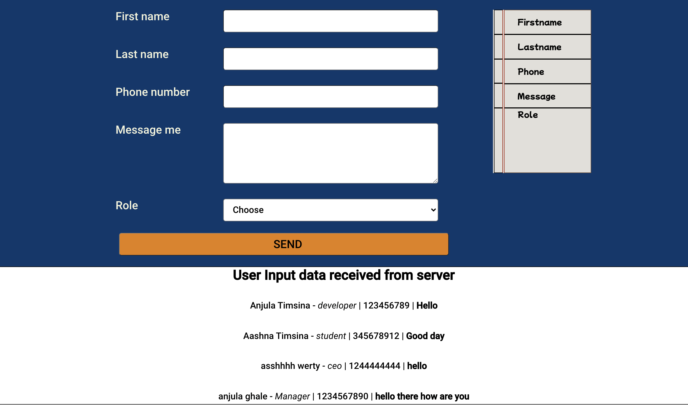

## Controlled Form App

This is the project created using react application to learn react components, router dom and controlled form.

### components Used

- Form
- Popup
- View

## Technologies used

Built with:

- Reactjs
- React router dom

## Screenshot

## Sources

- [reactjs documentation](https://reactjs.org/tutorial/tutorial.html)

## Authors and acknowledgment

Anjula Timsina

- [GitHub](https://github.com/meanjula)
- [linkedIn](https://www.linkedin.com/in/meanjula/)
