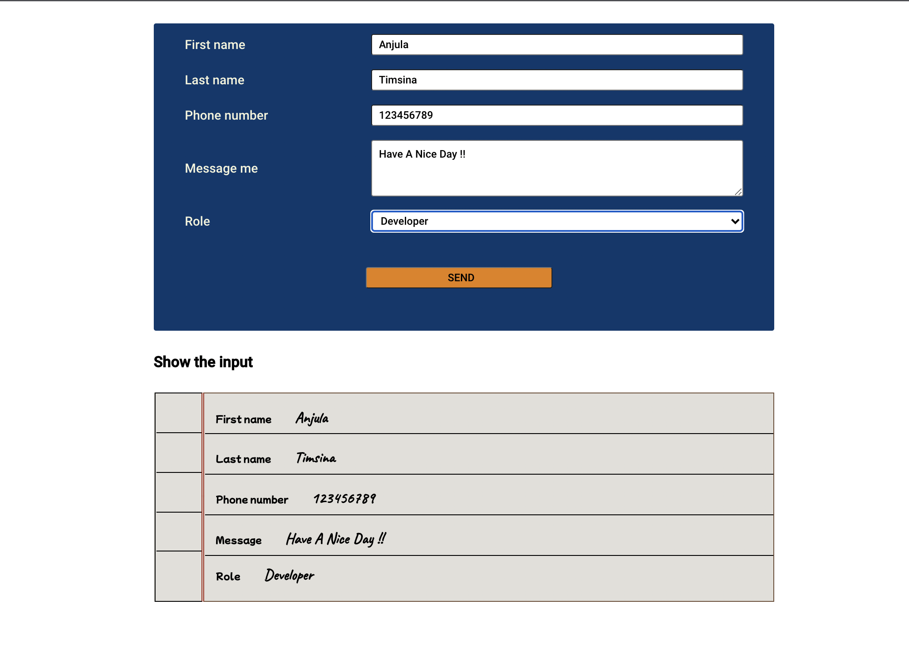

## Controlled Form App

This is the project created using create react app to learn react components,controlled form and conditional rendering.

### components Used

#### Form

form data is updated based on user input which are handled by setstate in formHandler function. Overall data is collected and submiited by clicking submit button which trigger the popup handler and makes it true and finally shows the popup box.

#### Popup

Popup component receive all the updated data from formHandler(usestate) as props and display it on popup box.

#### View

View also gets user input data as props and shows it in the browser as notepad which is achieved with some css tricks.

## Technologies used

Built with:

- Reactjs

## Screenshot

## Sources

- [reactjs documentation](https://reactjs.org/tutorial/tutorial.html)

## Authors and acknowledgment

Anjula Timsina

- [GitHub](https://github.com/meanjula)
- [linkedIn](https://www.linkedin.com/in/meanjula/)
